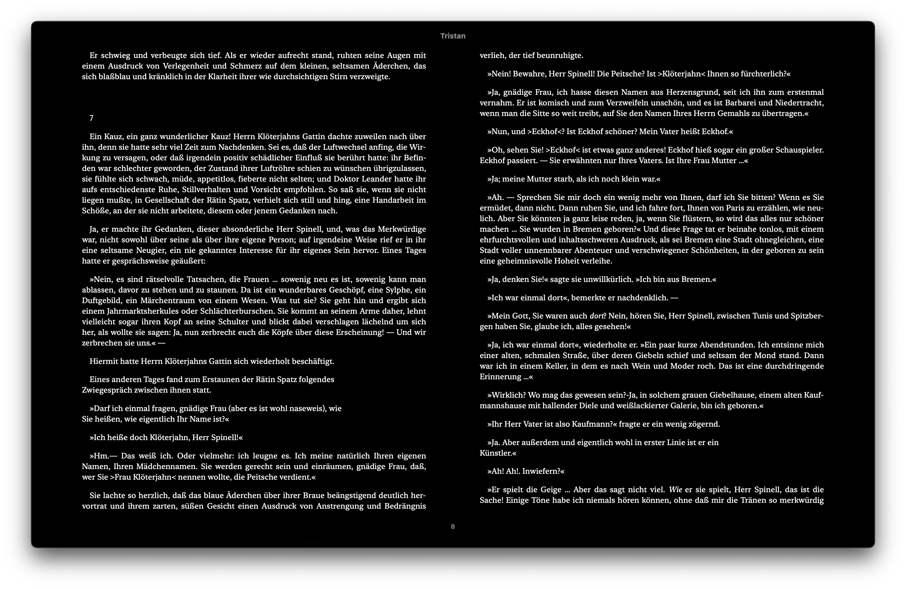
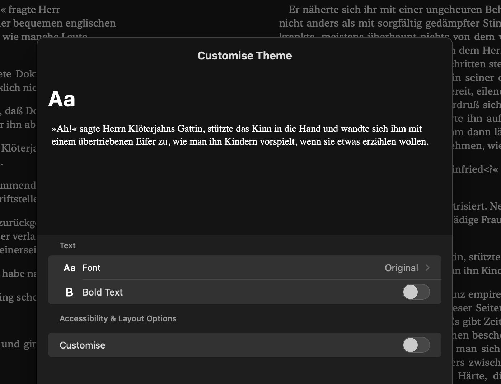
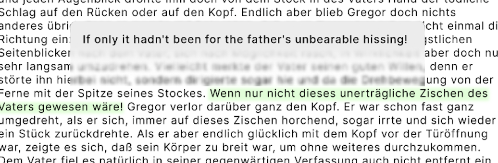
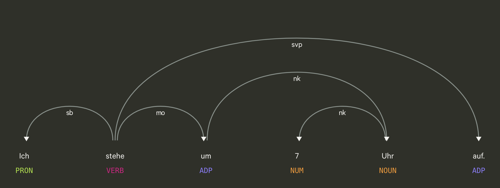

# Requirements
## Overview
E-reader's goal is to help people read foreign language texts by providing easy inline translations and annotations that allow users to store translations of words and expressions.
Storing these allows users to track language progress with a "known word count", and enables them to better evaluate their reading level. 

The goal is for the reader to be language agnostic, with the ability to "plug in" different language support.
Initial support should be for E-pub files.
## Design
UI should be minimal, clutter free and should render the content as intended and formatted, including illustrations. It must be responsive and scale according to the device or windows size.
E.g one column of text if the window is too narrow, or two full columns when possible.

The user can select between different reading modes: sentence, paragraph, continuous scroll or full page.


Example from macOS "Books" application.
### Customisation
Text-size, font, text colour and background should be customisable. By default there should be a light and dark-mode, with options for creating and saving custom colour schemes. Unless a user overrides the colour scheme, the system's default theme should be applied by default.

When customising the reader the user should be provided a short text preview, e.g a paragraph, and be shown in real-time how changing sliders for size, font type, line spacing, character spacing and word spacing affect the reading experience.
This along with colour scheme is global for the user, i.e not for each text.

Example from macOS "Books" application.
### Annotations, tagging and translation
Users highlight words or sentences for annotating (tagging) and/or translating. In the example below the user has highlighted a sentence for translation.

Example from Figma prototype.

Translations, unlike annotations/tags are not stored but provided via translation APIs like Deepl or Google translator. 

Annotating or tagging is a function where the user can select a word or several, and store them with some meaning. This could be the translation of the word, grammatical tenses or translations of set phrases or idioms.

Difference between annotations/tags and translations:
- Translations are provided by external providers, like Google or Deepl.
- Translations are not stored permanently. May be cached for performance.
- Translations are used to help understand in-context.
- Annotations/tags are user created.
- Annotations/tags are reusable and context independent.
- Annotations/tags can store multiple meanings of a word or phrase.
- Annotations/tags can be used to help the user understand grammatical concepts.

#### Open problems
Some languages, for example German, have separable verbs. This is where one part of the verb is separated from the root and is placed at the end of a sentence. 

E.g the word "anfangen" (to start) could be separated like this in a sentence: "Wir fangen jetzt an" -> "We're starting now". It is important to note that "fangen" != "anfangen". "Fangen" means to catch, and "an" is a preposition, so a language learner could easily misinterpret more complex and ambiguous sentences. 

In order to tag the word "anfangen" with the meaning "to start". We need to somehow associate "fangen" with "an". However both of these words are words in themselves, this makes it difficult for the program to highlight to the user that these words are still under active learning.
The user might already be familiar with the meaning of "fangen", to catch, but unfamiliar with "anfangen" or separable words in general. A naive implementation would highlight the wrong words with the wrong meaning.

Some solutions could be:
- Use a tokenizer to break down words into their component parts. Usually big libraries have good language support and could support tokenizing separable german words.
- Implement a hacky solution where the user could put both words in one tag. When the front-end wants to highlight unknown/active learning words it needs to iterate through the sentences and implement a custom algorithm to determine if the words are part of a separable sentence or not.

### Plugin support
The reader must support plugins. These could add additional functionality to the reader like:
- Bionic-reader text highlighting. 
- Daily reading streak plugin.
- Anki integration.
- Language support.
- Different translators.
- Dictionary integrations
- Graph view of tags/annotations.

The reader should support plugins that directly impact the text processing pipeline as well as more general functionality.
Plugins could be chained 

## Ideas

Discard manual tagging/annotation.
	There seems to be a lot of good tokenization tools out there that can correctly tag words and identify their functionality in a sentence. An idea would be to remove the manual tagging feature and just rely on the ML models for grammar analysis and highlighting. 
	The result might heavily depend on the quality of the model and which language(s) it was trained on. However since this will be a tool for learning languages any sufficiently proficient user will no longer need this tool and can instead rely on grammar explanations written in their target language.

OpenAI Integration.
	Add GPT integration to e.g simplify and explain complex sentences.

Support more filetypes.
	Add e.g PDF support or integration with RSS-feed or similar.
Add quizzing support.
	Based on chapter, e.g, we could feed the text into the transformer and ask for it to summarise it in the language. Or create questions based on the text the user just read to increase retention and understanding.

# System design

## Security considerations
The text pre-processor will handle untrusted input in the form of e-pub files. As such appropriate sanitation and validation measures should be implemented to prevent malicious code in epubs being executed.

The files should validated based on [EPUB conformance checkers](https://www.w3.org/TR/epub-33/#dfn-epub-conformance-checker) from the W3 epub standard. 

The front-end should handle e-pub files as untrusted input, preventing malicious e-pubs from executing code even when served from the backend.
## API
Backend will generate Json data that will be used by the frontend to augment the reading experience. Since the json files can get very long it is important that the frontend can query the backend only for the parts that it needs at a time. 

The API can provide a [cursor](https://relay.dev/graphql/connections.htm) to track where in the book the user is in relation to the pre-processed data.

Json schema should follow the [Google format guide](https://google.github.io/styleguide/jsoncstyleguide.xml).

In addition the API needs to provide functionality to retrieve the appropriate e-pub from the database, along with the corresponding pre-processed data as well as annotations. As well as provide bookmarking functionality.

## Testing
Unit tests on the pre-processor should include timing tests for processing of various books. The tests should also include real-world e-pub books for testing as well as test files that are e.g too large, invalid or the wrong file format.

The UI should be tested using automated tools as well as rendering tests and alignment test for indices.

## Stack
The desktop app will be Electron based, built using React with Typescript on the frontend. The backend will be built using Node.js with Typescript, running Python scripts for ML functionality due to the tooling available for using machine learning with Python.

### Backend
The backend will leverage the Spacy Python ML libary to analyse the book being read using part-of-speech tagging to help the user navigate the sentence's grammar.

The result of the sentence analysis can also be used to determine when sentences start/end, which can be useful if we want to provide the user with an easy shortcut to translate the current sentence.
We can extract indices for when the different words start, and their sub-components and overlay those on top of the text to highlight them. If the indices are incorrect, or the grammar analysis is mistaken there should be a way for the user to correct them.

By using the indices and their respective tags, e.g PRON, VERB, we don't have to send text line by line or word by word to the front-end, but can instead simply rely on the front-end to separately render the e-pub, with all the content it includes (e.g images) and provide the indices as metadata. Hopefully that would also allow us to leverage existing e-pub rendering libraries.

One problem would be ensuring alignment with the text rendered on the front-end and to the words that the indices actually refer to. This can be hard since the Tokenizer probably doesn't like XHTML as part of it's input, so when processing it we have to extract the raw text, then reassemble it. 
There might be other possibilities when performing the book preprocessing. One option, since e-pub is consists mainly of XHTML, could be to edit the e-pub in the backend, adding id markers in the `<p>` and `<h1>` tags. We could then use these ids to correlate the text analysis with the text content.

#### Example e-pub XHTML
```html
<h1 id="pgepubid001">DIE <br /> VERWANDLUNG </h1>

<p class="center" style="line-height: 2em; margin-bottom: 5em;">VON <br />
  <big style="font-size: large;">FRANZ KAFKA</big>
</p>

<p class="center gesperrt" style="line-height: 1.5em;">KURT WOLFF VERLAG <br /> LEIPZIG </p>
<p class="center gesperrt page-break">BÜCHEREI »DER JÜNGSTE TAG« BAND 22/23</p>
<p class="center" style="margin-top: 6em;">COPYRIGHT KURT WOLFF VERLAG • LEIPZIG. 1917</p>
```
In the example above, we could append a XHTML `id` attribute to the paragraphs. This solution might be brittle and requires looking into the e-pub spec. There might be books that use that attribute as part of their styling, and since we can only have one `id` that can cause problems.

#### Example analysis code
```Python
import spacy  
  
nlp = spacy.load("de_core_news_sm")  
text = "Ich stehe um 7 Uhr auf."  
  
# Process the text with SpaCy  
doc = nlp(text)  
  
for token in doc:  
    print(token.text, token.pos_, token.dep_)
```

```plaintext
Ich   PRON sb
stehe VERB ROOT
um    ADP mo
7     NUM nk
Uhr   NOUN nk
auf   ADP svp
.     PUNCT punct
```

The value of the tags, PRON, VERB and so on, depend on the corpus that was used to train the tagger, which depends on the model used. Different models will have to be tested. The license also needs to be taken into account.

### Frontend
Spacy has created a library, now deprecated, that can be a good inspiration for how to visualise and implement this on the front-end. Example visualizer tool: https://spacy.io/usage/visualizers



Library to visualise on the frontend (deprecated).
https://github.com/explosion/displacy
Other libraries and frameworks that could be useful or for inspiration:
* https://github.com/internetarchive/bookreader
* https://github.com/mozilla/readability
* https://github.com/futurepress/epub.js
* https://github.com/gerhardsletten/react-reader

### CI/CD
Version control will be handled by Git with Github for hosting code and for build pipelines. The project will use a rebase and squash git strategy, along with [conventional commits](https://www.conventionalcommits.org/en/v1.0.0/) to maintain a linear git history and enable automation based on commit messages.

#### Branching strategy
The project will be trunk-based with short-lived feature branches. Other short-lived branches are:
- `/feature`
- `/bugfix`
Feature branches are atomic application features, i.e every piece of code needed for that feature to run, it must stand on its own. Feature branches are squashed before rebased onto `main`.
#### PR
1. Create a branch:
	- `/feature`: contains all commits needed to deliver that specific application feature.
	- `/bugfix`: contains all commits needed to rectify an identified application bug.
2. Develop feature/bugfix and


| Type     | Description                                                              |
| -------- | ------------------------------------------------------------------------ |
| feat     | New feature.                                                             |
| fix      | A bug fix.                                                               |
| docs     | Documentation only changes.                                              |
| style    | Changes that do not affect meaning of code, formatting, white-space etc. |
| refactor | Changes that neither fixes a bug nor adds a feature.                     |
| perf     | Changes that improve performance.                                        |
| test     | Adding missing or correcting existing tests.                             |
| build    | Changes that affect the build system, maven, npm, gulp etc.              |
| ci       | Changes to CI configuration files and scripts.                           |
| chore    | Other changes that don't modify src or test files.                       |
| revert   | Reverts a previous commit.                                          	  |